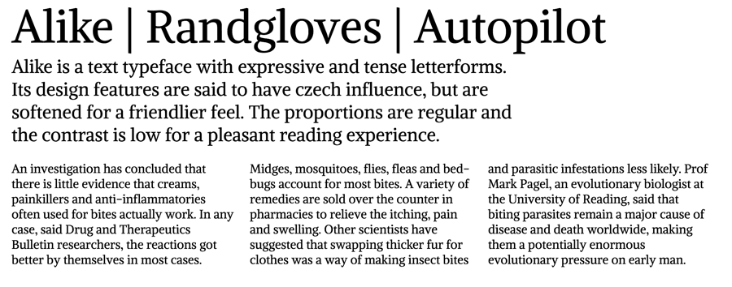

### Alike Open-Source font

Alike is a text typeface with expressive and tense letterforms.
Its design features are said to have czech influence, but are
softened for a friendlier feel.

The proportions are regular and the contrast is low for
a pleasant reading experience.

Designed by Svetlana Sebyakina 2009-2011.

Alike is a Unicode typeface family that supports 
languages that use the Latin script and its variants, and 
could be expanded to support other scripts.

### Copyright
Copyright 2009 (c) Svetlana Sebyakina 2009-2010 (http://sebyakina.com/)
Copyright 2011 (c) Cyreal (cyreal.org)

