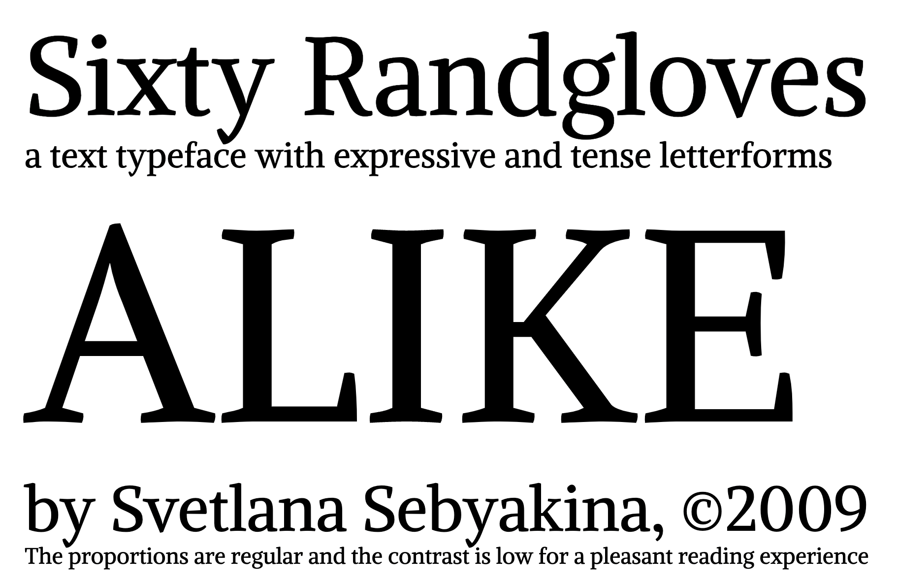

### Alike 

Alike is a text typeface with expressive and tense letterforms.
Its design features are said to have czech influence, but are
softened for a friendlier feel.

The proportions are regular and the contrast is low for
a pleasant reading experience.

Designed by Svetlana Sebyakina 2009-2011

Alike is a Unicode typeface family that supports 
languages that use the Latin script and its variants, and 
could be expanded to support other scripts.

### Copyright
Copyright 2009 (c) Svetlana Sebyakina (http://sebyakina.com/)

Copyright 2011 (c) Cyreal (www.cyreal.org)

## Changelog

When you update your font (new version or new release), please report all notable changes here, with a date.

**27 Oct 2023. Version 1.300 / Emma Marichal**
- Font infos (fstype, Use Typo Metrics)
- Missing Glyphs generated (GF Latin Core)
- Comb accents added and composites created

### License

This Font Software is licensed under the SIL Open Font License, Version 1.1. This license is available with a FAQ at: [http://scripts.sil.org/OFL](http://scripts.sil.org/OFL)
